# SSL — Stealth Settlement Layer

[]()
[](https://chain.link/ccip)
[](https://worldcoin.org/world-id)

**Stealth Settlement Layer (SSL)** is a privacy-preserving, sybil-resistant trading platform for tokenized Real World Assets (RWAs).

Public blockchains natively expose trading activity, leaving institutional traders and whales vulnerable to front-running, copy-trading, and strategy leakage. SSL mitigates these risks by providing a "dark pool" trading experience: identities are verified for compliance, but order matching and settlement remain completely confidential through the use of **Trusted Execution Environments (TEEs)** and **Shield Addresses**.

## 🌟 Core Value Proposition

1. **Confidential Order Matching:** Orders are client-side encrypted (ECIES). The order book is matched entirely inside a **Chainlink CRE (Confidential Routing Engine) TEE**. Order details (price, size, direction) are mathematically proven to be invisible to the public, the blockchain, and even the platform operator.
2. **Sybil-Resistant Compliance via ACE:** Leveraging **World ID** and **Chainlink ACE** (Arbitrary Compute Environment), SSL enforces strict on-chain compliance. Unverified entities are blocked from depositing into the settlement vault by on-chain policies.
3. **Private Settlement:** Upon matching, matched tokens are transferred to single-use **Shield Addresses** generated exclusively for that trade. The on-chain footprint guarantees liquidity without directly linking the settlement destination back to the trader's primary wallet.
4. **AI-Powered Trading Interface:** Features a natural language AI chatbot (powered by Google Gemini) acting as a trading terminal assistant. It parses complex context-aware trading orders and provides "Stealth Intelligence"—a real-time trend confidence indicator based on anonymized settlement data.

---

## 🏗️ System Architecture

### System Workflow


### 3-Phase Settlement Flow

```mermaid
sequenceDiagram
    participant U as User
    participant SC as Smart Contracts
    participant B as Backend
    participant TEE as CRE TEE

    Note over U, TEE: Phase 1 — Identity
    U->>B: Submit World ID ZK Proof
    B->>TEE: verify-workflow
    TEE->>SC: onReport → WorldIDVerifierRegistry.isVerified = true

    Note over U, TEE: Phase 2 — Confidential Matching
    U->>U: Generate Shield Address + Encrypt Order
    U->>B: Submit Encrypted Order (blob only)
    B->>TEE: matching-workflow (encrypted order book)
    TEE->>SC: Check isVerified(buyer) + isVerified(seller)
    TEE->>TEE: Match orders privately inside enclave
    TEE->>B: Settlement intent (no plaintext order data)

    Note over U, TEE: Phase 3 — Private Settlement
    B->>SC: settleMatch() via Convergence Vault
    SC->>SC: Transfer RWA + USDC to Shield Addresses
```




---

## 🤖 AI System Workflow

SSL includes a Gemini-powered AI chatbot embedded in the platform. It provides two distinct capabilities:

### 1. Natural Language Order Parsing

The AI parses free-text trading commands using conversation context — e.g. *"buy the tMETA we discussed at market"* — resolving ambiguous tokens from previous messages in the same chat session.


### 2. Stealth Intelligence Oracle

The oracle aggregates anonymized settlement data to produce a VWAP-based trend signal for each trading pair, without revealing any individual trade.

```mermaid
flowchart LR
    A(["Settled Orders DB\n per pairId"]) --> B(["Calculate VWAP\n price × filledAmount"])
    B --> C{"≥ 2 settlements?"}
    C -->|No| D(["GATHERING INTEL\n show progress bar"])
    C -->|Yes| E{"Latest price vs VWAP"}
    E -->|Above| F(["BULLISH signal\n + confidence %"])
    E -->|Below| G(["BEARISH signal\n + confidence %"])
    F --> H(["OracleIndicator UI\n refreshes every 5s"])
    G --> H
```



### 3. AI Advisor Context Pipeline

For general chat messages, the AI advisor is given privacy-safe portfolio context from the user's synced wallet balances — held in browser memory only, never persisted.


---

## 📦 Project Structure

| Directory | Description |
|-----------|-------------|
| **`/frontend`** | React 19 + Vite app. Features the trading terminal, World ID verification widget, and the Gemini-powered AI order parsing chatbot. |
| **`/backend`** | Bun + Hono API. Manages the encrypted order book database, AI context services, realtime Oracle aggregation, and bridging to the CRE TEEs. |
| **`/cre/matching-workflow`** | The Chainlink CRE enclave logic that decrypts the order book and executes trades unseen. |
| **`/cre/verify-workflow`** | The Chainlink CRE enclave logic that validates World ID zero-knowledge proofs and pushes results to the on-chain registry. |
| **`/Compliant-Private-Transfer-Demo`** | Foundry project containing all Solidity smart contracts (`WorldIDVerifierRegistry`, `WorldIDPolicy`, etc.) and deployment scripts. |

---

## 🔑 Key Addresses (Ethereum Sepolia)

| Contract | Address |
|---|---|
| Convergence Vault | `0xE588a6c73933BFD66Af9b4A07d48bcE59c0D2d13` |
| CRE Forwarder | `0x15fC6ae953E024d975e77382eEeC56A9101f9F88` |
| USDC Token | `0x1c7D4B196Cb0C7B01d743Fbc6116a902379C7238` |
| WorldIDVerifierRegistry | `0xb1eA4506e10e4Be8159ABcC7A7a67C614a13A425` |

### Supported RWA Tokens

- **Equities:** `tMETA`, `tGOOGL`, `tAAPL`, `tTSLA`, `tAMZN`, `tNVDA`
- **ETFs / Indices:** `tSPY`, `tQQQ`
- **Fixed Income:** `tBOND`

---

## 🚀 Local Development Setup

### Prerequisites
- [Bun](https://bun.sh/) v1.2+
- [Foundry](https://book.getfoundry.sh/) (for contract development)
- [CRE CLI](https://docs.chain.link/cre) (for enclave simulation)
- PostgreSQL (for the backend order book)

### 1. Smart Contracts
If deploying customized compliance policies:
```bash
cd Compliant-Private-Transfer-Demo
forge install
forge build --via-ir

export PRIVATE_KEY=<your_sepolia_private_key>
export RPC_URL=<sepolia_rpc_url>

# Register SSL tokens to Convergence Vault
forge script script/RegisterAllSSLTokens.s.sol --rpc-url $RPC_URL --broadcast --private-key $PRIVATE_KEY

# Deploy World ID Compliance Layer
forge script script/03_DeployWorldIDPolicy.s.sol --rpc-url $RPC_URL --broadcast --private-key $PRIVATE_KEY
```
*Note: Ensure the resulting `WorldIDVerifierRegistry` address is updated in your backend `.env` and CRE workflow configs.*

### 2. Backend Server
```bash
cd backend
cp .env.example .env   # Configure DATABASE_URL, OPENAI_API_KEY (for Gemini), EVM_PRIVATE_KEY
bun install
bun run db:push
bun run dev
```

### 3. Chainlink CRE Simulation
To simulate the TEE workflows locally:
```bash
cd cre/matching-workflow && bun install
cre workflow simulate matching-workflow --target=staging-settings

cd ../verify-workflow && bun install
cre workflow simulate verify-workflow --target=staging-settings
```

### 4. Frontend Terminal
```bash
cd frontend
bun install
bun run dev
```

---

## 🛠️ Tech Stack

- **Smart Contracts:** Solidity, Foundry, Chainlink ACE (Arbitrary Compute Environment)
- **Confidential Computing:** Chainlink CRE (Confidential Routing Engine)
- **Identity:** World ID (Zero-Knowledge Proofs)
- **Backend:** Bun, Hono, PostgreSQL, Prisma, Viem
- **Frontend:** React 19, Vite, TailwindCSS (Dark-mode optimized)
- **AI & Data:** Google Gemini (via OpenAI SDK), Finnhub API

## License
MIT
